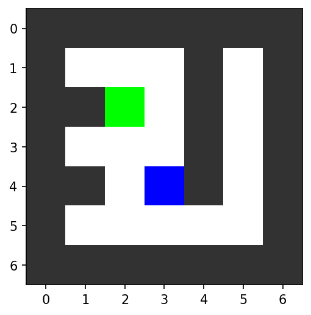
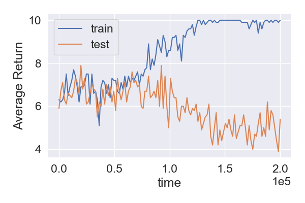

# Maze

Inspired by: https://arxiv.org/abs/1907.01475

Simple maze environment for DRL generalization studies.




## Installation

Clone the git repository and use the following pip command in the downloaded directory.

```
pip3 install -e .
```

## Training

Use train.py with the following to train for a million frames. This also saves the model at the end of training.

```
python3 train.py
```

## Viewing Model

Likewise, use view.py with the following to save an mp4 file of the agent playing.

```
python3 view.py
